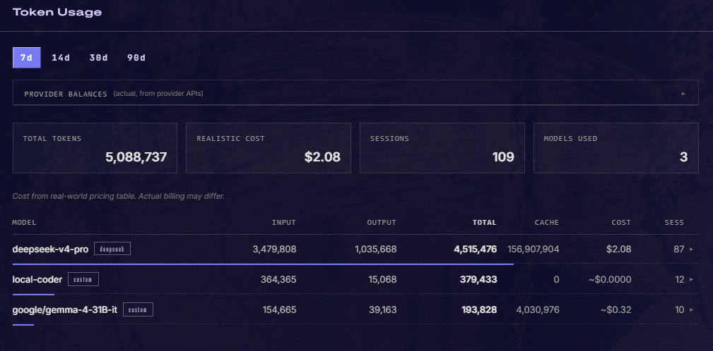

# Hermes Token Usage Dashboard Plugin

A dashboard UI plugin for [Hermes Agent](https://github.com/NousResearch/hermes-agent) that adds a **Token Usage** tab showing per-model token consumption analytics with realistic cost estimation.



## Features

- **Per-model token breakdown** — input, output, total, and cache read tokens
- **Realistic cost estimation** — pricing table with up-to-date provider rates (DeepSeek, OpenAI, Anthropic, Google, etc.), plus actual provider-reported cost when available
- **Provider balance checks** — live balance from DeepSeek (`/user/balance`) and OpenRouter (`/api/v1/credits`)
- **Expandable model rows** — click any model row to see capabilities (tools/vision/reasoning), tool calls, last used date, pricing details, and percentage shares
- **Period selector** — 7d / 14d / 30d / 90d time windows
- **Persistent UI state** — collapsed sections remember their state across tab switches
- **Zero build step** — pure JavaScript using the Hermes dashboard SDK, no bundler needed

## Installation

```bash
# Install from GitHub
hermes plugins install DongHoon5793/hermes-token-usage

# Enable it
hermes plugins enable hermes-token-usage

# Restart the gateway
hermes gateway restart
```

Then open your Hermes dashboard → **Token Usage** tab.

## How It Works

- **Frontend**: `dashboard/dist/index.js` — a self-contained React component registered via the Hermes dashboard SDK (`window.__HERMES_PLUGINS__`)
- **Backend**: `dashboard/plugin_api.py` — FastAPI routes mounted at `/api/plugins/token-usage/` providing:
  - `GET /models?days=30` — per-model usage with realistic cost calculation
  - `GET /balance` — live balance checks for DeepSeek and OpenRouter

All token data comes from the Hermes session database (`~/.hermes/state.db`), which tracks every conversation's input/output tokens automatically. Cost is computed from a built-in pricing table using real-world per-token rates, not Hermes's internal estimate.

## Requirements

- Hermes Agent (any version with dashboard plugin support)
- Gateway running with dashboard enabled
- For balance checks: `DEEPSEEK_API_KEY` and/or `OPENROUTER_API_KEY` in `~/.hermes/.env`

## License

MIT
